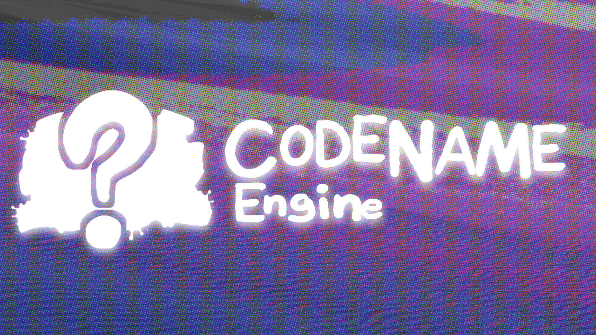

# FND' - Codename Engine Build

T H E &nbsp; V E S S E L S &nbsp; A R E &nbsp; R E A D Y.

A F T E R &nbsp; A L L &nbsp; T H E S E &nbsp; Y E A R S.

A R E &nbsp; Y O U &nbsp; R E A D Y ?

DUSTIN MOD DOWNLOADS:
-  **GAMEBANANA:** [https://gamebanana.com/mods/613322](https://gamebanana.com/mods/613322)
-  **GAME JOLT:**  [https://gamejolt.com/games/fridaynightdustinFULL/1012008](https://gamejolt.com/games/fridaynightdustinFULL/1012008)

# ENGINE???
This mod is made on a extensible modding framework for FNF: Codename Engine. This source code folder can be placed in the mods folder to be played in codename!

Download Codename:
- Windows: [https://tinyurl.com/cne-download-windows](https://nightly.link/CodenameCrew/CodenameEngine/workflows/windows/main/Codename%20Engine.zip)
- Mac OS: [https://tinyurl.com/cne-download-macos](https://nightly.link/CodenameCrew/CodenameEngine/workflows/macos/main/Codename%20Engine.zip)
- Linux: [https://tinyurl.com/cne-download-linux](https://nightly.link/CodenameCrew/CodenameEngine/workflows/linux/main/Codename%20Engine.zip)

Codename's Github: [https://github.com/CodenameCrew/CodenameEngine](https://github.com/CodenameCrew/CodenameEngine)

Little note, dustin builds on gamejolt come with an exe built in!!
